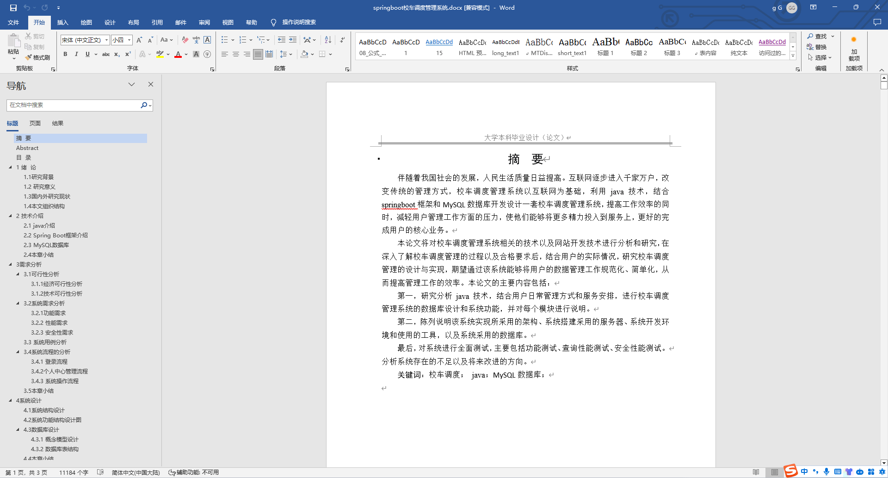
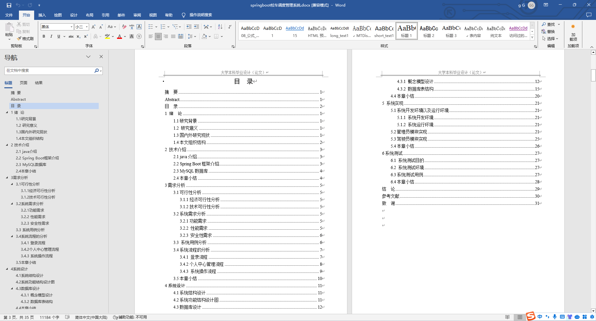
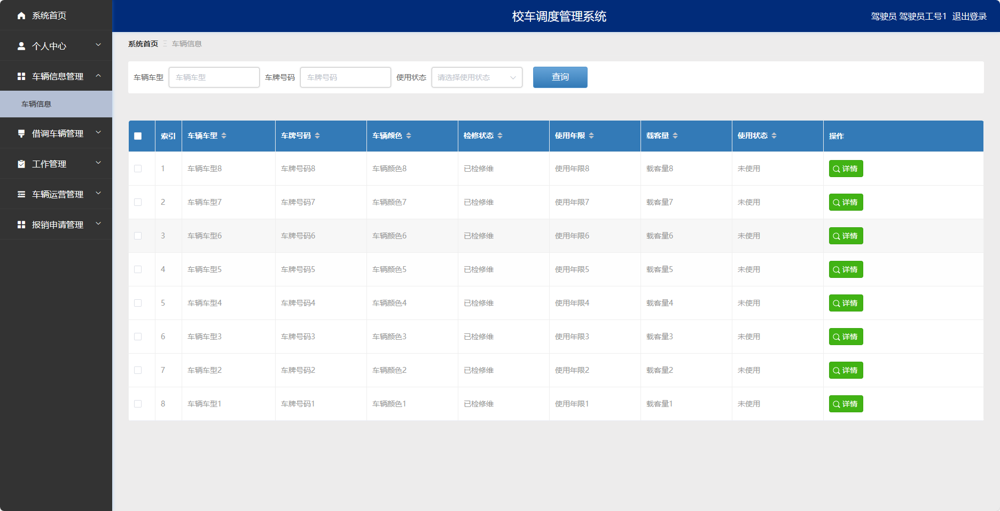
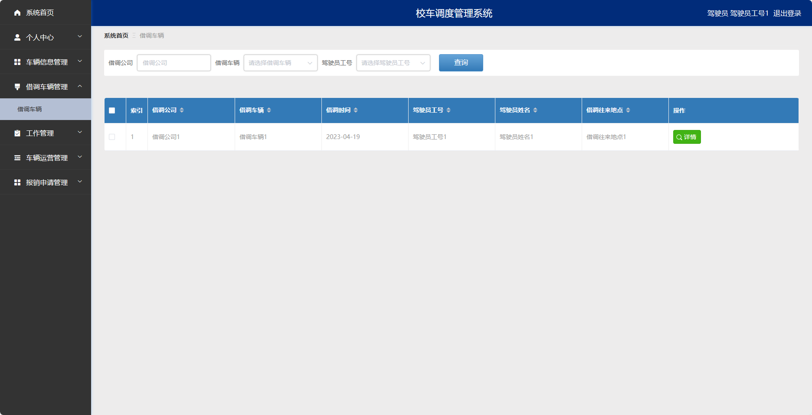
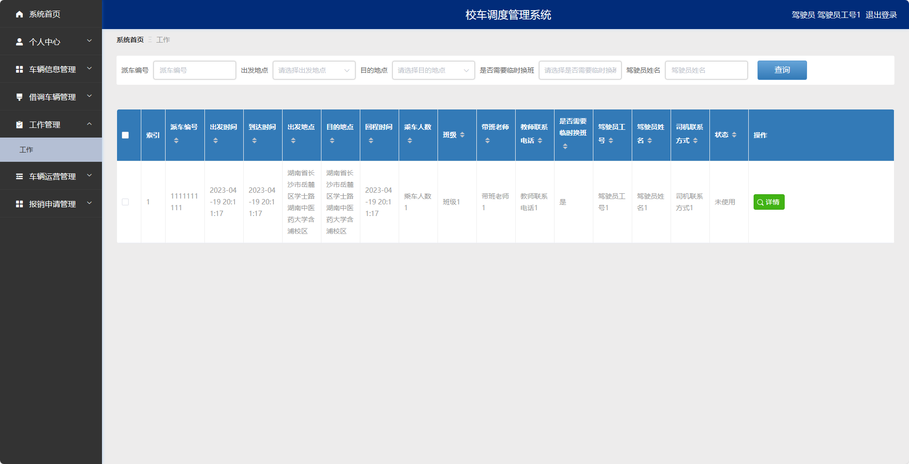
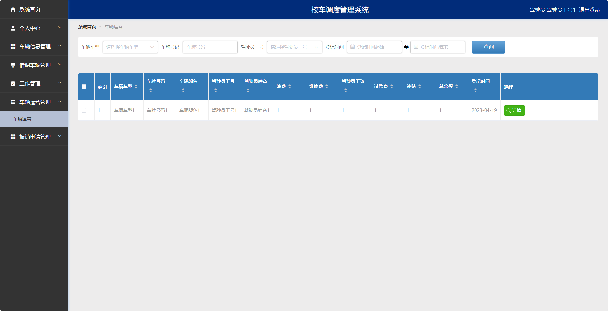
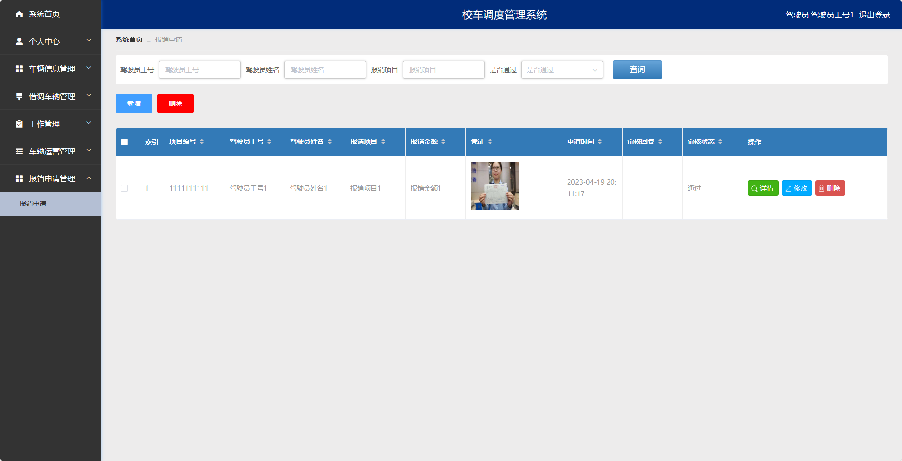
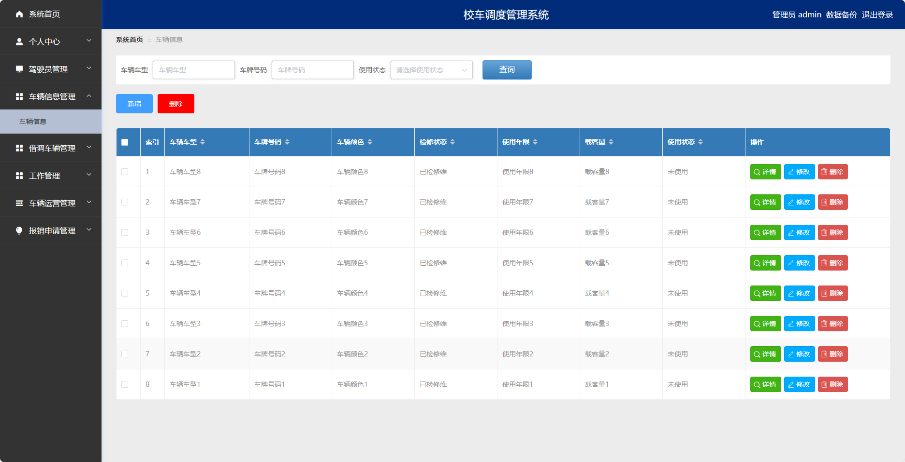
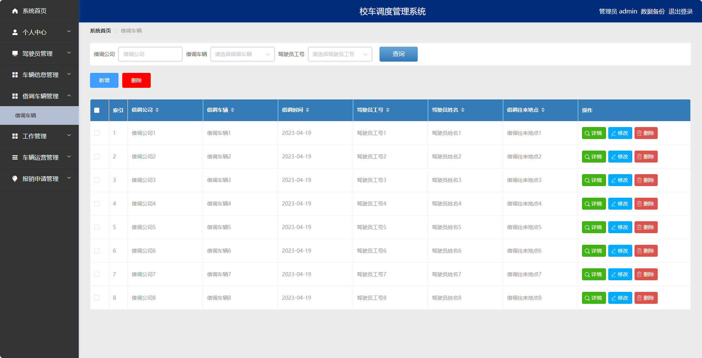
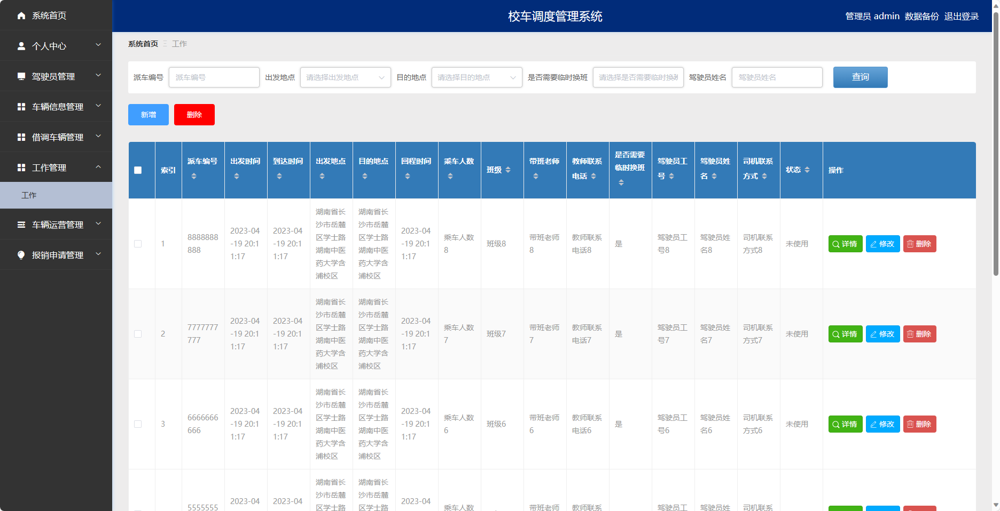

基于SpringBoot的校车调度管理系统（程序+论文）
=
- 完整代码获取地址：从戎源码网 ([https://armycodes.com/](https://armycodes.com/))
- 作者微信：19941326836  QQ：952045282 
- 承接计算机毕业设计、Java毕业设计、Python毕业设计、深度学习、机器学习
- 选题+开题报告+任务书+程序定制+安装调试+论文+答辩ppt 一条龙服务
- 所有选题地址https://github.com/nature924/allProject

一、项目介绍
---
基于Spring Boot框架实现的校车调度管理系统，系统包含两种角色：管理员、用户,系统分为前台和后台两大模块，主要功能如下

### 后台：
### 管理员角色：
- 个人中心：管理员可以管理个人信息，修改密码等。
- 驾驶员管理：管理员可以对驾驶员信息进行增删改查等操作。
- 车辆信息管理：管理员可以管理车辆的基本信息。
- 借调车辆管理：管理员可以管理车辆的借调情况。
- 工作管理：管理员可以管理驾驶员的工作排班。
- 车辆运营管理：管理员可以管理车辆的运营情况。
- 报销申请管理：管理员可以管理报销申请。

### 用户角色：
- 个人中心：用户可以管理个人信息，修改密码等。
- 车辆信息管理：用户可以查看车辆的基本信息。
- 借调车辆管理：用户可以借调车辆，包括选择借调的时间、归还的时间等。
- 工作管理：用户可以查看自己的工作排班。
- 车辆运营管理：用户可以查看车辆的运营情况。
- 报销申请管理：用户可以提交报销申请。

### 驾驶员角色：
- 个人中心：驾驶员可以管理个人信息，修改密码等。
- 车辆信息管理：驾驶员可以查看车辆的基本信息。
- 借调车辆管理：驾驶员可以借调车辆，包括选择借调的时间、归还的时间等。
- 工作管理：驾驶员可以查看自己的工作排班。
- 车辆运营管理：驾驶员可以查看车辆的运营情况。
- 报销申请管理：驾驶员可以提交报销申请。

二、项目技术
---
- 编程语言：Java
- 数据库：MySQL
- 项目管理工具：Maven
- 前端技术：VUE、HTML、Jquery、Bootstrap
- 后端技术：Spring、SpringMVC、MyBatis

三、运行环境
---
- 操作系统：Windows、macOS都可以
- JDK版本：JDK1.8以上都可以
- 开发工具：IDEA、Ecplise、Myecplise都可以
- 数据库: MySQL5.7以上都可以
- Tomcat：任意版本都可以
- Maven：任意版本都可以

四、运行截图
---
### 论文截图：

### 程序截图：

